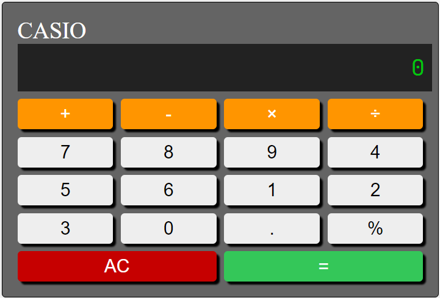
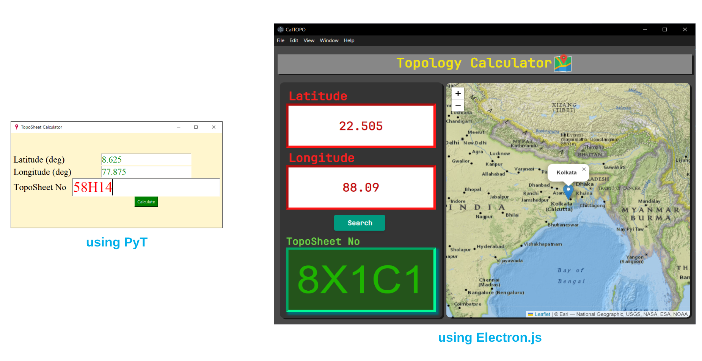

# 100 Apps Challenge

Contains all the apps of three categories `DesktopApp`, `WebApp`, `MobileApp` that I have taken the challenge to build

<!-- by learning many different programming languages. -->

<!-- ## Desktop GUI Apps -->

## #01 - Simple Calculator

## #02 - calTopo

## #03 - GeoVisual Analytics

Based on the EU population using `leaflet.js`, `turf.js` and `d3.js` and can be extended to any other data represented in `.csv` and `.json`

## #04 - Raster Visualization

Based on the EU population using `leaflet.js`, `turf.js` and `d3.js` and can be extended to any other data represented in `.csv` and `.json`

<!-- ## Mobile Apps

Coming soon...

## WebApps

Coming soon... -->
