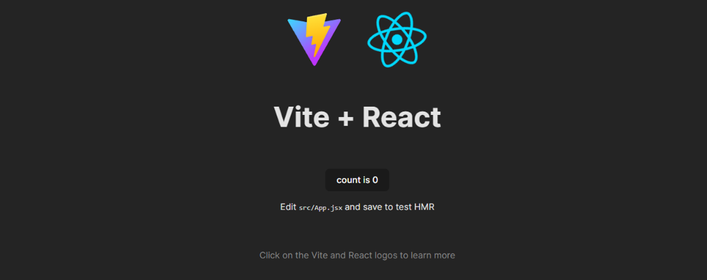
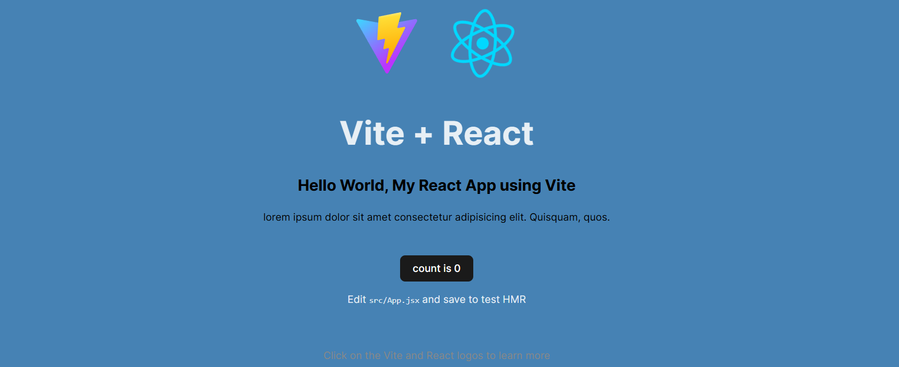

# React + Vite

A template to get React working in Vite with HMR and some ESLint rules.

## Local Setup

### installing Vite.

```sh
npm create vite@latest myReactApp_Vite
```
User will be prompted to select a framework. We can use the arrow keys to select the framework that we want to use. In this case, we will be using React. Once we have selected the framework, Vite will create a new project for us. It will also install all of the dependencies that we need.

```
> npx
> create-vite myReactApp_Vite

√ Package name: ... myreactapp-vite
√ Select a framework: » React
√ Select a variant: » JavaScript

Scaffolding project in D:\Git-Space\myAppDev\WebApps\myReactApp_Vite...

Done. Now run:

  cd myReactApp_Vite
  npm install
  npm run dev

PS D:\Git-Space\myAppDev\WebApps> cd .\myReactApp_Vite\
```

We can also use the --template flag to specify a template. For example, if we want to use React, we can run the following command:

```sh
npm create vite@latest my-vite-app --template react
```

## Folder Structure
### Initial
```md
myreactapp-vite/
├── .gitignore          # Avoid Files for Git Commits
├── README.md           # Documentation
├── package.json        # Dependencies
├── vite.config.js      # Configuration
├── eslint.config.js    # Linting
├── index.html          # Entry
├── src/                # Source
│   ├── main.jsx        # Entry Point of React App
│   ├── App.jsx         # Write React Code Here
│   ├── index.css       # Global Styles
│   └── App.css         # Component Styles
└── assets/             # Assets
    ├── react.svg       # Logo
    └── vite.svg        # Logo
```
### Current
```md
myreactapp-vite/
├── .gitignore
├── README.md
├── package.json
├── vite.config.js
├── eslint.config.js
├── index.html
├── .env
├── public/
│   ├── images/
│   └── favicon.ico
├── dist/
├── src/
│   ├── main.jsx
│   ├── App.jsx
│   ├── index.css
│   ├── App.css
│   └── components/
│       └── Header.jsx
├── scss/
│   └── main.scss
└── assets/
    ├── react.svg
    └── vite.svg
```

## Development Server
We can edit some settings in the **vite.config.js** file such as port port that the development server runs on. By default, it runs on port **5173**. I prefer port **7070**.

```js
export default defineConfig({
export default defineConfig({
  plugins: [react()],
  server: {
    port: 7070,
  },
});
```

To start the development server, we can run the following command:

```sh
npm install
```
```sh
added 260 packages, and audited 261 packages in 23s

108 packages are looking for funding
  run `npm fund` for details

found 0 vulnerabilities
```

```sh
npm run dev
```

```sh
> myreactapp-vite@0.0.0 dev
> vite

  VITE v6.1.0  ready in 280 ms

  ➜  Local:   http://localhost:7070/
  ➜  Network: use --host to expose
  ➜  press h + enter to show help
```
### Screenshot 01


## Using SASS

Sass support is built into Vite. We can use it by installing the sass package.
```sh
npm install sass
```
Let's create a **scss** folder and add a **main.scss** file and change the body background color.

```scss
body {
  background-color: steelblue;
}
```
Then we can import our Sass file into the **App.jsx** file.

```js
import './scss/main.scss';
```

### Screenshot 02


## Building for Production
Let's go ahead and build our application for production. We can do this by running the build script.

```sh
npm run build
```
This will create a dist folder. This is where our production build will be.

```sh
> myreactapp-vite@0.0.0 build
> vite build

vite v6.1.0 building for production...
✓ 34 modules transformed.
dist/index.html                   0.44 kB │ gzip:  0.29 kB
dist/assets/react-CHdo91hT.svg    4.13 kB │ gzip:  2.05 kB
dist/assets/index-CPxobNkt.css    1.42 kB │ gzip:  0.72 kB
dist/assets/index-Dyh-FWkN.js   186.73 kB │ gzip: 59.10 kB
✓ built in 1.64s
```

We can serve this folder using the preview script.

```sh
npm run preview
```
You should now see your production build.

## Plugins
Vite does a good job providing out of the box solutions, so make sure you check out the [features guide](https://vitejs.dev/guide/features.html) before looking for a plugin.

With that said, you can extend the features of Vite using plugins, which are basically Rollup plugins with some Vite-specific options. You can find a list of official [plugins here](https://vitejs.dev/plugins/) as well as a list of [community plugins here](https://github.com/vitejs/awesome-vite#plugins).


## References
- Source - https://www.traversymedia.com/blog/vite-crash-course
- [Vite](https://vitejs.dev/guide/)
- [React](https://reactjs.org/)
- [React Router](https://reactrouter.com/en/main)
- [React Router DOM](https://reactrouter.com/en/main/start/tutorial)
- [React Router DOM v6](https://reactrouter.com/en/main/start/tutorial)
